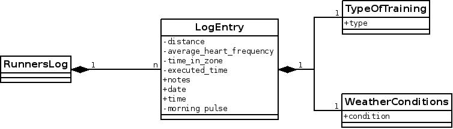

#Runner's log - Project Blastoff

##Purpose of the project

The application keeps track of each training session done by the runner. It has to be able to give statistics and query the information.  
The information is entered manually by the runner, in which the system can propose appropriate default values for some types of information.

##Scope of the Work

##Stakeholders

* me
* my girlfriend (optional)

##Constraints

NA

##Names (glossary)

<table>
<tr><td>hf</td><td>heart frequency</td></tr>
<tr><td>in zone</td><td>time that the hf was in a predetermined interval (zone)</td></tr>
</table>

##Facts and Assumptions

* If the user omits entering certain non necessary data, the system will put an average as value.
* There will be no notion of user profile. The user specific data will be stored in his home folder on his PC or on his personal android device.

##Cost

6 weeks, 1 hour per weekday. Some electricity. The use of my laptop ;-).

##Risk

NA

#Business Use Cases

1. Input training session data
2. Query training session

#Product Use Cases

##Use Case 1: Entering training session data

**UC ID**: RL01  
**Description**: The user enters data about his training session.  
**Goal**: The data is sucessfully entered.  
**Trigger**: The user opens the program and indiciates he wants to enter data.  
**Stakeholders**: Me.  
**Normal Flow**:

1. The system enters the date.
1. The user enters the weather conditions
2. The user enters the start time.
3. The user enters the executed time.
4. The user enters the morning pulse.
4. The user enters the training zone.
4. The user enters the in zone time.
5. The user optionally enters some remarks

**Extensions**

1. The user alters the date.  
 1. The flow continues step 2.  
2. The user omits to enter the weather conditions.  
  2. The system fills in a default value of unknown. Continue step 3.  
3. The user does not enter a start time.  
  3. The system uses as default the current time. Continue step 4.  
4. The user does not enter an executed time.  
  4. The system displays an error message that executed time is mandatory. Continue step 4.  
5. The user does not enter morning pulse.  
  5. The system enters an avarage of previously entered morning pulses as a default. Continue step 6. 
    1. There are no morning pulses available
      1. The system displays a message and continues step 5.  
6. The user does not enter a training zone.  
  6. The system uses a value of 'unknown'. Continue with step 7.  
7. The user does not enter an in zone time.  
 7. The system uses a value of 0h0m0s. Continue step 8.  

**Frequency of use**: Once a day, between 0 and 5 days a week.

##Use Case 2: Browsing the trainings history

**UC ID**: RL02  
**Description**: The user browses the training data entered earlier.  
**Goal**: An easily accessible way to display previous records.  
**Trigger**: The user activates the browsing functionality.  
**Stakeholders**: Me.  
**Normal Flow**:

1. The user activates the browsing functionality.
2. The user swipes chronologically through previously entered data.

**Extensions**

1. There is no data.
  1. The system lets the user know this through a message.

#Class Diagram

#Screen design

##Enter a training session

